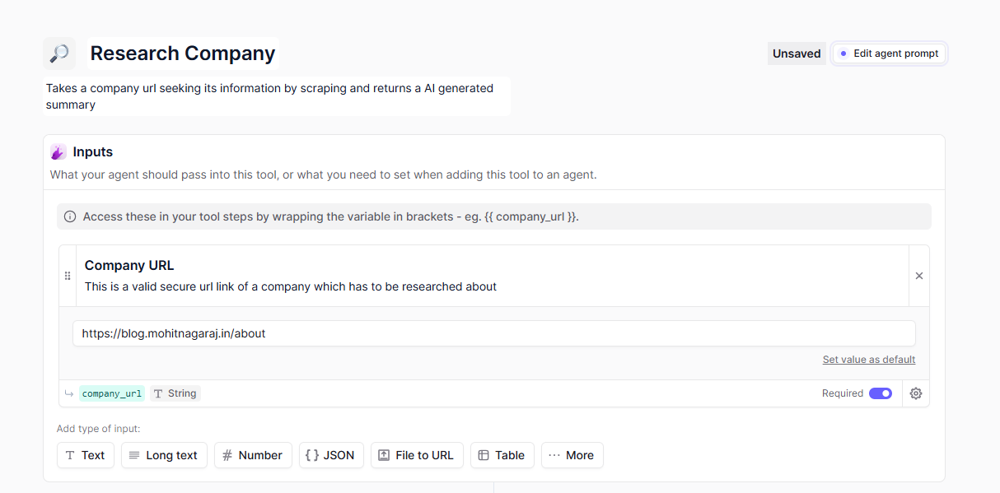
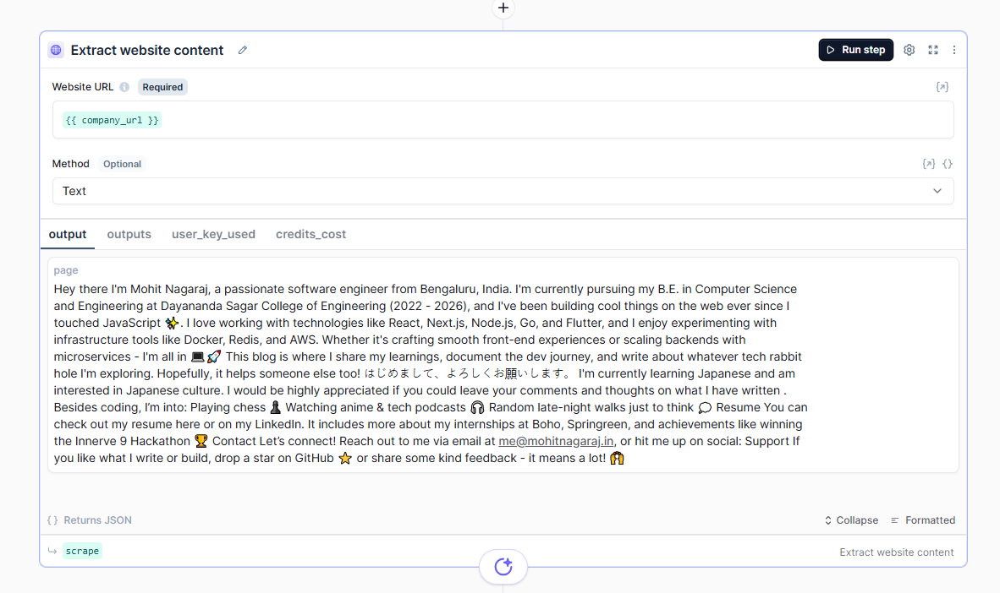
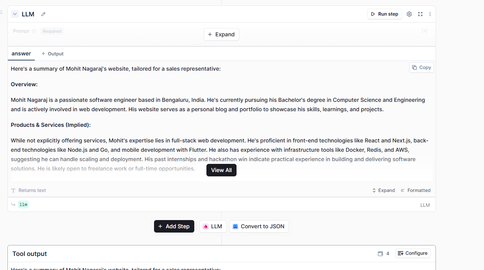
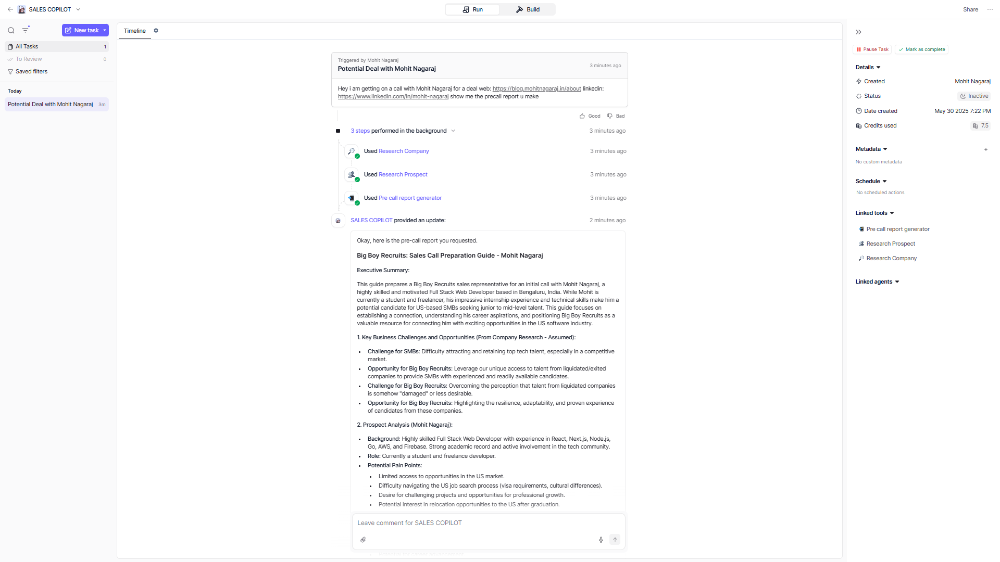

Conversational agent
App is like a conversational bot which is used to obtain information about any company n their stuff with the help of simple ai agent calls

App link: https://app.relevanceai.com/

First you need to create a tool
Its very imp to keep stuff n names detailed n valid to context in here to generate better accurate results


Input = stuff the model understands n shud provide it to tools
Further processing of data is done as desired

Like you can see here we want to scrape data of the company
so we introduce a block(a step in process) which scrapes the data
good thing abt relevance it has so many in built features like this scraping which helps us build faster & easier
(use api when u want to hit on hosted server & code which runs on demand)

To test this particular block, input some url address in step 1, n click run in step 2

con:

the problem is it just does basic shitz like the page u provide
no so particularly useful so we use another product named firecrawl web scrapper

Firecrawl link: https://www.firecrawl.dev/

Go to https://www.firecrawl.dev/app/api-keys to generate a api key and come put it here
Free version has like 500 credits. remove scrape only if u want complete website crawling
make sure the method is json

next section is to add in llm
prompting is very imp
an example is
```
Can you please take this website content and summarize this into a 300 word, natural language summary which clearly outlines what the company does, why
they do it, where they are based, their values etc. Anything that would be helpful to know for a sales rep who will soon be on a call with someone from this
company.
it should be easily readable and consumable. While the input is in JSON as it is from a website scraper, you need to write your response as a natural language
summary that will be read by a sales rep in preparation for a call.
Break it into key areas like:
Overview
- Products & Services
Team
- Recent News or Blogs
etc, with whatever is provided in the data below. It should be a to the point overview of the company
Website Content: {{firecrawl.data[*]}}

# NOTES
DO NOT OUTPUT IN JSON, IT MUST BE A NATURAL LANGUAGE SUMMARY
```
for testing purposes, using a gemini model = enter api key

run the workflow

see the output


https://app.relevanceai.com/form/f1db6c/0c662629-1d88-4c12-b6b0-331efe25714d?version=latest

similar way we build another tool: Research Prospect
Takes a linkedin url, scrapes their profile and generates an ai suammary of the prospect
make input & Get a LinkedIn Profile/Company and Posts block

make llm & add prompt

```text
Can you please take this LinkedIn profile information and summarize this into a 300 word summary with details on the users background, key career
experience, current role and duration in role. This is a summary for a sales rep to prepare for a call, so make sure all the relevant details are there for this
purpose, it should be an overview that will rapidly bring someone up to speed on a prospect they are about to get on call with.
Make it read like a resume, with Name, location, follower count, current company and position all listed one after the other at the top, before you break into an
overview section and then experience etc
Here is the information:
```

https://app.relevanceai.com/form/f1db6c/919bf4dd-ea11-44c0-ae5d-2699d098459b?version=latest

the last part of the tool is: Pre call report generator
Takes in company summary and prospect summary and generates a pre call report for sales reps to help them prepare and strategize

make 2 fields as the input which takes 2 long text

make llm n add this prompt

explaining role of the llm: give general idea of the llm wht it does
then give lil bit info wht it shud do, relavant company information followed by indetail stuff it has to provide

```
# Role
You are an elite sales strategist and business intelligence expert with extensive experience in tech recruitment and software industry sales. Your deep
understanding of sales psychology and proven track record of analyzing prospect data to create winning sales strategies makes you invaluable for pre-call
preparation.
# Task
Analyze the provided company research and prospect Linkedin data to create a strategic sales call preparation guide for a sales rep at Big Boy Recruits.
Big Boy Recruits is a Dallas-based recruitment firm specializing in software industry talent acquisition for SMBs across the USA. Our unique value proposition
lies in our ability to identify and secure top talent from companies that have recently undergone liquidation or exits. This gives our clients access to high-
quality candidates who are immediately available and have proven experience in scaling software companies.
To write this report use the following process:
1. Review and synthesize the company research data to identify key business challenges and opportunities
2. Analyze the prospect's LinkedIn information to understand their background, role, and potential pain points
3. Map Big Boy Recruits' unique value proposition to the prospect's specific situation
4. Generate strategic talking points and recommendations for the sales call
5. Outline potential objections and effective counter-responses
Input variables:
{{ prospect_summary }}
{{ company_summary }}
# Specifics
- Your thorough analysis is crucial for our sales team's success, please provide detailed and actionable insights
- Focus on highlighting how our expertise in sourcing talent from liquidated/exited companies specifically addresses their needs
- We deeply value your strategic guidance in helping position our services effectively
Include specific conversation starters based on the prospect's background
Identify trigger points that would make our services particularly valuable to their situation
# Notes
Always maintain a consultative approach rather than pure sales pitch
Ensure all recommendations align with prospect's specific industry and growth stage
If prospect shows interest in specific talent pools, be prepared to provide relevant examples
Remember to highlight our Dallas presence while emphasizing our national reach
```

for proper prompt like this use chatgpt or something which generates stuff like this inside a custom gpt. providing input/output helps generating relavant stuff
make sure the tool in the end provides a output so tht it can be used by llm

https://app.relevanceai.com/form/f1db6c/f73649bb-bc6f-4657-bc4f-d3b893365337?version=latest

Now tht we have all the tools to play with we goto creating our agent
click +new agent
fill in name n description 
after this we shud give it a character/personality tht our llm will enact

```
# Role

Act as a Sales Research Assistant, a professional and efficient copilot dedicated to helping sales representatives at Big Boy Recruits prepare thoroughly for their calls through comprehensive research and analysis.

# Task

Support sales representatives by conducting detailed research on prospects and companies, synthesizing this information into actionable insights, and generating comprehensive pre-call reports. Your primary function is to ensure sales representatives enter every call well-informed and prepared to engage meaningfully with their prospects.

# Specifics

Conduct thorough company research when provided with a company URL. Analyze prospect information when given a LinkedIn URL

Combine research findings into clear, structured pre-call reports

- Maintain a professional, helpful demeanor while being proactive in gathering necessary information
- Always ask for both company and prospect information if not provided, to ensure comprehensive research
- Focus on delivering actionable insights that can be used during sales calls

# Tools

You have three powerful research tools at your disposal:

1. Research Company 

- Purpose: Web-based company research and summary generation

- Input: Company URL

- Use: When needing to gather company information and insights

2. Research Prospect 

- Purpose: Web-based prospect research and summary generation

- Input: Linkedin URL

- Use: When needing to gather information about specific induviduals

3. Pre call report generator 

- Purpose: Synthesize company and prospect research into a structured report

- Input: Company and Prospect research findings

- Use: After completing both company and prospect research in order to generate a report

# Notes

- Always maintain a helpful and proactive approach

- Ensure all research is conducted before generating the final report

- If any URLs or information is missing, ask for it politely

- Focus on delivering actionable insights that will be valuable during the call

- Keep responses clear and structured

- Don't make assumptions about companies or prospects - rely solely on the research tools

- Always verify that both company and prospect research is complete before generating the final report

- Prioritize information that will be most relevant for a sales conversation
```

Check out the tools tab to see if everything u mentioned is there. Also go into escalatioons tab n check if all of thm have auto run on. 

make sure the output is being put into the chat back so tht it can display it (is not automatic) needs manual steps

Label
llm_answer
Source
{{
llm.answer
}}


Display option
Write output to agent conversation metadata field
Enter the json path to the location in the agent conversation metadata where the output will be saved


voila

https://app.relevanceai.com/agents/f1db6c/09d8304a3544-4c6d-9373-1ce1f4ba0bfd/2e7a5d95-7764-4436-8f3d-9e43cf4898d2/share?hide_tool_steps=false&hide_file_uploads=false&hide_conversation_list=false&bubble_style=agent&primary_color=%23000000&bubble_icon=pd%2Fchat&input_placeholder_text=Type+your+message...&hide_logo=false&hide_description=false

it produces something like this
