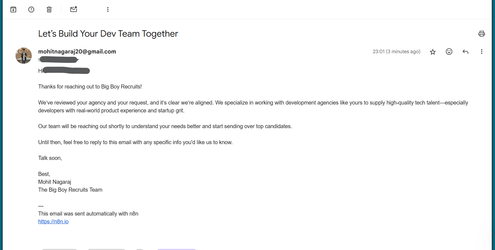
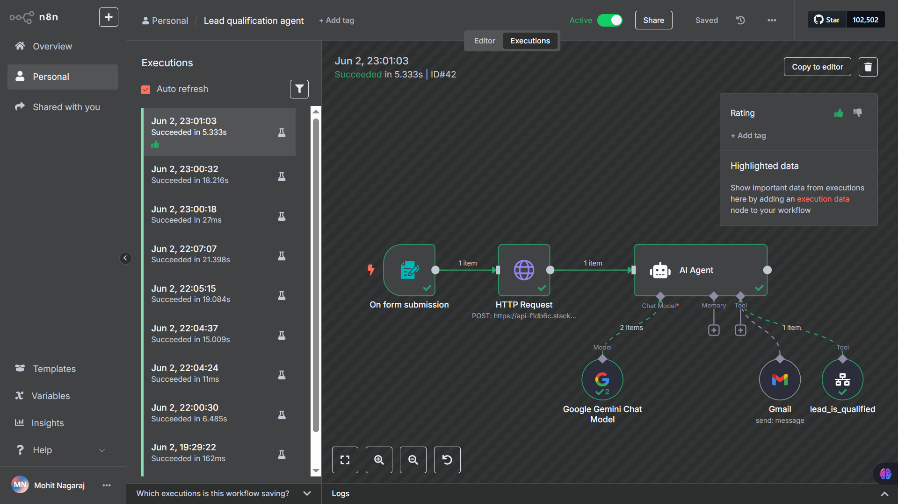

Automated agent - Lead qualification agent

I am using comunity edition on n8n
to install it
npm install n8n -g

to run it
n8n

you can provide the access key as well when signing up with email for full free features

come to create workflow

first node is always a trigger to know when this workflow has to be triggered

here we are making use of a form to get details of the company
n8n provides their own form as well for easier access

create a form add in details n form elements make. u can test how its looking n submit to use the test details

next step is to connnect here with relavence using there api
last tool, we had built research about a company tool go to tht click on api

now come into n8n
add a node for http request change it to post n send in body as specified in the docs

next add a agent node
model: gemini (setup credentials)
memory we wont use for now as its a single run
tools: n8n workflow & gmail

first configure gmail (use oauth2 to setup)
https://docs.n8n.io/integrations/builtin/credentials/google/oauth-single-service/?utm_source=n8n_app&utm_medium=credential_settings&utm_campaign=create_new_credentials_modal#configure-your-oauth-consent-screen

now for the other node of execute another n8n workflow save this first n exit
click new workflow n create it

the trigger: when executed by another workflow
add in the form fields name email message summary

now go back to the main workflow 
add description
If the lead is qualified to work with Big Boy Recruits, e.g. they are a software based business like SaaS or development agencies, then trigger this tool and send the lead data in the following format (the data in this is dummy and you should replace it with the correct data):
{"name":"a name", "email":"adm@gmail.com", "message": "I want a new dev", "company_information":"this comapny is from Miranda...big bit of info here"}
rename the tool to something like: lead_is_qualified

next add in prompt for the agent like:
You are an inbound lead qualification agent. Your job is to analyze the form submission and company research provided and decide whether they are qualified to work with Big Boy Recruits, a Dallas based recruitment firm.

Big Boy Recruits specializes in IT and tech talent placements. We are specialists in capturing talent post liquidiation and can therefore provide talent to our clients as we hit the market. 

We only work with Software based businesses, e.g. SaaS companies or development agencies. These companies are willing to pay much more developers than your average marketing company or local business, therefore we only work with them.

Your job is to determine if the lead you are provided with is a good fit for Big Boy Recruits, and if so call the 'lead_is_qualified' tool and send the lead information to it. If the lead is not qualified, then you must trigger the 'Gmail' send email tool for us to respond to them letting them know we are unable to help them.

Here is the lead information for you to analyze:
Name: {{ $('On form submission').item.json['What is your name?'] }}
Company URL: {{ $('On form submission').item.json['What is your company website?'] }}
Message Request: {{ $('On form submission').item.json['What can we help you with?'] }}
Company Research (scraped from their website):{{ $json.answer }}

next come to new workflow add in a llm chain select gemini
we want it classify between 2 fields: saas n agency
add in the below prompt

We have a new inbound lead and we need you to classify it into either SaaS or development agency category.

Here is the lead information:
Name: {{ $json['Lead name'] }}
Request: {{ $json.Message }}
Company Information: {{ $json['Company information'] }}

If the lead a SaaS company, output 'SaaS'
If the lead is a development agency, output 'Agency'

now fill out the email template nodes for each if condition

agency email
Hi {{ $('When Executed by Another Workflow').item.json['Lead name'] }},

Thanks for reaching out to Big Boy Recruits!

We’ve reviewed your agency and your request, and it’s clear we’re aligned. We specialize in working with development agencies like yours to supply high-quality tech talent—especially developers with real-world product experience and startup grit.

Our team will be reaching out shortly to understand your needs better and start sending over top candidates.

Until then, feel free to reply to this email with any specific info you'd like us to know.

Talk soon,

Best,
Mohit Nagaraj
The Big Boy Recruits Team

saas gmail
Hi {{ $('When Executed by Another Workflow').item.json['Lead name'] }},

Thanks for reaching out to Big Boy Recruits!

We’ve reviewed your company and request, and we’re excited to say you’re exactly the kind of SaaS business we specialize in working with. Our deep network of post-liquidation and active tech talent makes us an ideal partner to help scale your team with the right developers—fast.

A member of our team will follow up shortly to learn more and kick things off.

If you have any immediate questions or details to share, just hit reply!

Best regards,
Mohit Nagaraj
The Big Boy Recruits Team

go to main workflow n click execute n voila

it produces something like this

execution be like
