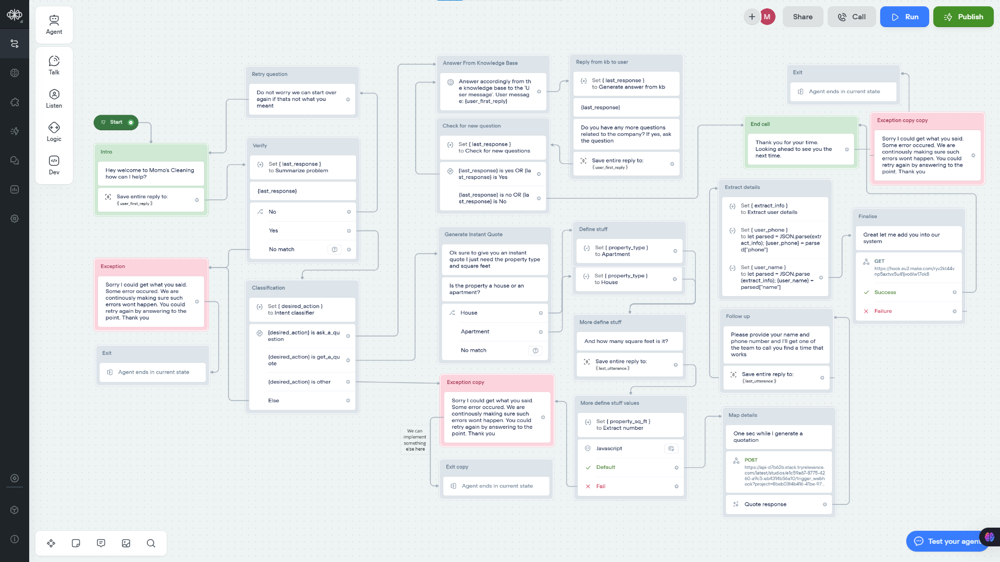

AI Customer Support & Lead Generation Agent for Website & Phone Built on Voiceflow

PURPOSE
This agent is designed to be able to answer questions from potential customers via a website chatbot and also viaa phone number that can be called. Not only can it answer questions, but it can also generate instant quotes for
interested parties. Finally, the agent is able to capture lead information for those who have been given a quote, this
allows the sales team to follow up and set an appointment.

Tool 1: Answer From Knowledge Base 📚
Can answer questions about the company based on docs provided

Tool 2: Generate Instant Quote 🧾
If the prospect is interested in services or pricing, an instant quote can be generated which takes in their property type and size.

Tool 3: Capture Lead Information
When a prospect has been given a quotation, the agent can ask for their contact information and then logs it in the CRM

USAGE 🎬
Person arrives on website and either clicks to chat with the chatbot or enters the phone number into their phone.
The agent then determines what they are needing help with, and then routes them to the correct tool (knowledge base Q&A or instant quote)

Guide:
First go in here
https://creator.voiceflow.com/signup

here make a basic workflow
first message shud be from the agent so make a block 'intro' and add message from start step. add in the below prompt

Hey welcome to Momo's Cleaning how can I help?

then we need to listen so add a listen step inside intro block
in here we want to listen to a particular entities or entire user reply

we need to capture entire users reply so change it in the top from entities to entire user reply
then save this information into a new variable by creating one user_first_reply

make a new block of set (it is typically used to set variables - present inside logic section)
create prompt
for variable: here we make use of last response, a single variable used to store the latest response given by the ai
for prompt: 
create new
click add to add the conversation history
add in the below prompt
Summarize the customers question below and ask them to confirm if thats what they meant. They should be able to answer only with yes or no, this is a confirmation step, not asking for more information.
Question:
{
first_user_reply
}
Ensure your tone is empathetic. Speak directly to the end customer. Keep your answer brief and two sentences max.

user shud hear this response right, so send them a talk message n plug in the last response

u can test only this much by clicking start

from here go to listen, add a choice step here
add 2 trigger for Yes n No each
You cud use no match always in production as fallbacks for safety

next add in a new set variable in new block 
this is to classify which category the request belongs to

set variable to desired_action
add in the below prompt
What does the customer want to do?
Ask a question, get a realtime quote or something else entirely?
You must output a label for this only, your options are:
"ask_a_question": general questions about our business, our services, how we operate etc, these will be routed to a knowledge base of our company docs to be answered
"get_a_quote": they are asking about pricing or have directly requested a quote etc, this will take them to a real time quotation tool that takes in their property type and size then returns the estimate.
"other": anything outside of these two
DO NOT INCLUDE ANY OTHER EXPLANATION OR REASONING IN YOUR RESPONSE, JUST GIVE THE LABEL AS THE OUTPUT ONLY.

add in a condition builder
add path for each cases by defining the condition
and then add in message for each of these paths

then add in a knowledge base by uploading ur pdf

go back to workflow
for the knowledge search add a kb search

from here add a prompt inorder to generate a message stored in last-response and talk it back to user

I made extra for user information to loop so it continues (improved version from the tutorial)
Based on the user's response below, does the user wants to more about the company? confirm it with a "yes" or "no"? Only return "yes" or "no" - do not provide any explanations.
User response: {user_reply}

Next tool
we add in first to say about these
Ok sure to give you an instant quote I just need the property type and square feet
one more message
Is the property a house or an apartment?
next select a choice
make & create 2 new intents house n apartment give description to them

make flow from each of them n set variable hardcode in the route
property_type = house/apartment

next send in a prompt to just extract the size from text
add in lil bit js code to convert string number if present to number

property_sq_ft = Number(property_sq_ft)

next clone a relevance tool 
https://app.relevanceai.com/notebook/d7b62b/8beb03f4b416-41be-9746-59d2b0fe4507/e1c59a67-8775-4260-a9c5-eb4314b56a10

make a api node n plug it in there

in order to send as number make it raw json n plug values there directly

next add in a prompt for formatting n paste 
Write a short and clear explanation of this quote for the customer's {property_type}:{raw_qoute_data} 
Your response will be read over the phone and so must be all in one paragraph, be no longer than 3-4 short sentences.
It should read like:
"Based on your requirements we can offer four different packages: Regular Maintenance Cleaning at ₹90, which covers standard weekly or bi-weekly cleaning, Deep Cleaning at ₹150 for a more thorough top-to-bottom refresh, Move In/Move Out Cleaning at ₹170 for preparing or cleaning after a home transition, and Post-Renovation Cleaning at ₹200 for handling construction dust and debris."
Do not ask a question at the end, just give them a description if the services and prices like above.

since we know the customer was waiting to hear our quote he was interested
so better follow up with their details for lead capture

so add a message telling
Please provide your name and phone number and I'll get one of the team to call you find a time that works
capture the last input
send it to prompt n extract the details
I am storing entire thing in 1 variable so tht it avoid being prompted 2times
next 2 sets i am using go to expression to kind of make use of js type syntax to name n phone by parsing json

next to capture lead deatils go to 
make.com
create a senario
create a webhook
copy the link
come back to workflow
paste it and send dummy data for webhook to realise wht it is

come back to webhook add google sheets node configure it
click on add a row
create a new sheet at sheets.new
write up table names
come to make.com map the fields to the table headers position accordingly

and its done

to test the app: https://creator.voiceflow.com/prototype/683e93e8abe040bae572991a

<iframe src="https://www.loom.com/embed/4a08125ec5284029af2cd765533eedfb?sid=47c3a4db-1e34-454d-8598-99985a160956" frameborder="0" webkitallowfullscreen mozallowfullscreen allowfullscreen style="position: absolute; top: 0; left: 0; width: 100%; height: 100%;"></iframe>

you can easily integrate their widget into any website

to connect with phone number
go to telephony add in auth token n ssid then u can make inbout/outbound call
the workflow will be trigged on call
outbound = curl endpoint

https://docs.voiceflow.com/docs/outbound-calls?_gl=1*1ly9rdm*_gcl_au*NTgxNzUzMzk1LjE3NDg5MzEyNDAuMTkxMTc5NDQ0MS4xNzQ4OTUxMzYzLjE3NDg5NTEzNjM.*_ga*MTE2NDY5MTk1OC4xNzQ4OTMxMjM3*_ga_1NT1L04113*czE3NDg5MzEyMzckbzEkZzEkdDE3NDg5Nzg4MzIkajU4JGwwJGgxOTIwODkxMDQ0